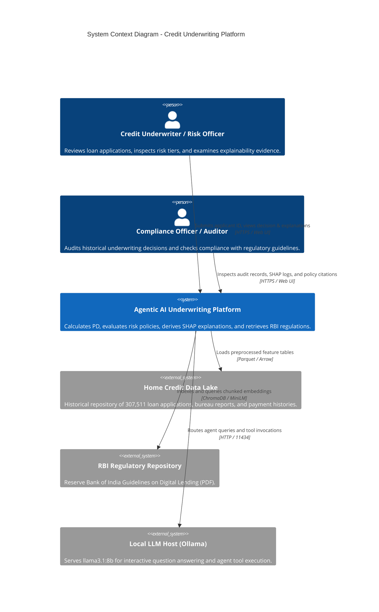
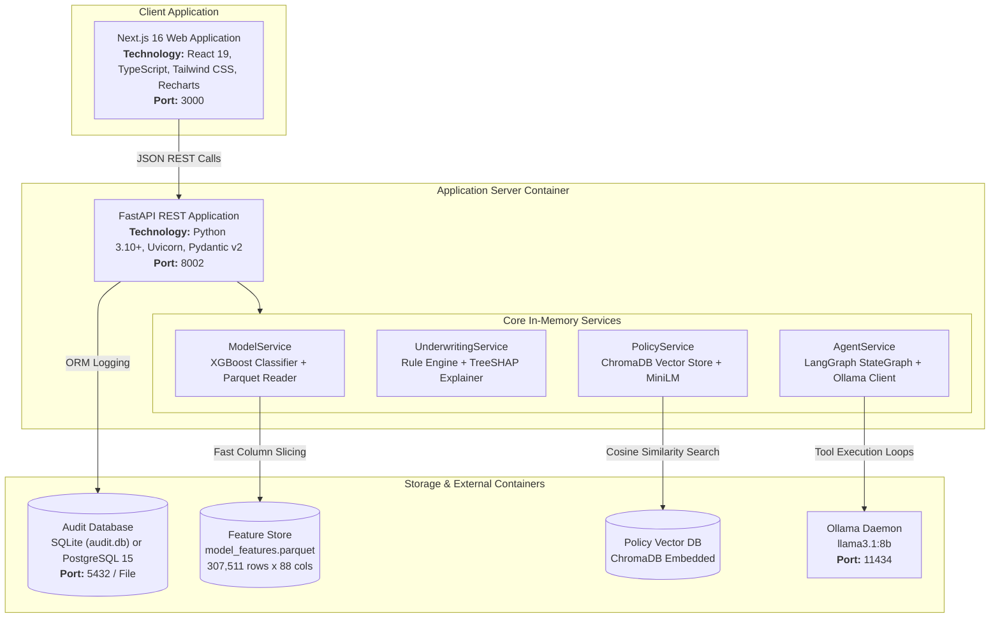
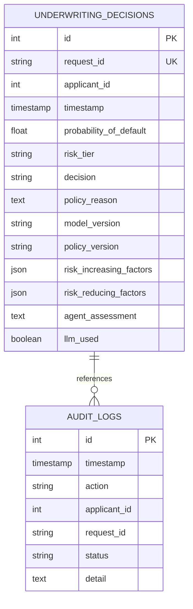

# High-Level Design (HLD): Agentic AI Credit Underwriting System

## 1. System Context & Scope

The **Agentic AI Credit Underwriting and Loan Risk Assessment System** automates the end-to-end evaluation of retail loan applicants by combining predictive machine learning, explainable AI, deterministic policy checks, and regulatory knowledge retrieval.

### System Context Diagram (C4 Level 1)

---

## 2. Container Architecture (C4 Level 2)

---

## 3. Subsystem Decomposition

### 3.1 Frontend Subsystem (`frontend/`)
- **Framework**: Next.js 16 with App Router, server-rendered layouts, and client-side reactive components.
- **Pages**:
  1. `/dashboard`: Portfolio statistics, decision split (Approve/Refer/Decline), risk tier distribution, and quick search.
  2. `/applicants`: Applicant search, demographic overview, financial ratios, bureau records, and previous application history.
  3. `/applicants/[id]`: Direct profile summary with rapid assessment trigger.
  4. `/underwriting/[id]`: Primary decision center displaying:
     - Prominent Decision Banner (`APPROVE` in green, `REFER` in amber, `DECLINE` in red).
     - Probability of Default (PD) risk gauge.
     - Bifurcated SHAP factors (Risk-Increasing vs. Risk-Reducing).
     - Regulatory Evidence citations from the RBI Digital Lending Guidelines.
     - Interactive AI Assistant chat interface.
  5. `/policies`: Semantic regulatory search engine with pre-indexed query chips.
  6. `/model`: Model architecture, training metrics (ROC-AUC, PR-AUC, Brier score), and top 15 global feature importance bar chart.

### 3.2 API & Gateway Subsystem (`backend/`)
- **FastAPI Core**: Lightweight ASGI microservice handling request routing, validation, and JSON serialization.
- **Lifespan Management**: Singleton pattern initializes heavy resources (`pd_xgboost.joblib`, `model_features.parquet`, `ChromaDB`) once at application startup. Subsequent requests read from pre-warmed memory in milliseconds.
- **Error Handling**: Global exception interceptor catching unhandled exceptions and returning structured RFC 7807 error responses.

### 3.3 Predictive & Explainable ML Subsystem (`backend/services/`)
- **Model**: `XGBClassifier` trained on the Home Credit Default Risk dataset (88 features, `scale_pos_weight` to address severe class imbalance).
- **Features**: Aggregated demographic, income, debt-to-income, credit-to-annuity, and bureau delinquency variables.
- **SHAP Engine**: `shap.TreeExplainer` computing exact Shapley contributions for tree-based models, resolving local positive (risk-increasing) and negative (risk-reducing) forces.

### 3.4 Regulatory Knowledge & RAG Subsystem (`backend/services/policy_service.py`)
- **Source Material**: Official Reserve Bank of India (RBI) Guidelines on Digital Lending (issued September 2, 2022).
- **Embedding Model**: `sentence-transformers/all-MiniLM-L6-v2` (384-dimensional dense vectors).
- **Vector Index**: Persistent ChromaDB instance indexing chunked clauses with strict metadata attribution:
  - `authority`: "Reserve Bank of India"
  - `source_file`: "Guidelines_on_Digital_Lending.pdf"
  - `page`: Specific page number of the guideline clause.

### 3.5 Agentic AI Subsystem (`backend/services/agent_service.py`)
- **Framework**: LangGraph `StateGraph` pattern.
- **Tools**:
  - `get_underwriting_result(applicant_id)`: Fetches PD, tier, decision, reason.
  - `get_shap_explanation(applicant_id)`: Fetches positive and negative feature contributions.
  - `search_rbi_policy(query)`: Queries ChromaDB for regulatory clauses.
- **Safety Boundary**: The agent has no write access, cannot alter decisions or calculated metrics, and must quote official tool outputs.

---

## 4. High-Level Data Model

---

## 5. Reliability, Failover & Scalability Strategy

1. **Decoupled Architecture**: The failure or absence of the LLM daemon does **not** degrade core underwriting. If Ollama is unreachable, `POST /underwrite` continues without interruption and `/agent/chat` delivers a deterministic text summary.
2. **Zero Ingestion Latency on Requests**: The 307k-row feature dataset is retained in-memory in columnar Apache Arrow/Pandas format, achieving single-millisecond applicant lookups.
3. **Stateless API Services**: The FastAPI container is completely stateless. Multiple instances can sit behind an NGINX or AWS ALB load balancer connected to a shared PostgreSQL instance.
4. **Reproducibility**: Model predictions are 100% deterministic given the static model artifact (`pd_xgboost.joblib`) and precomputed features.