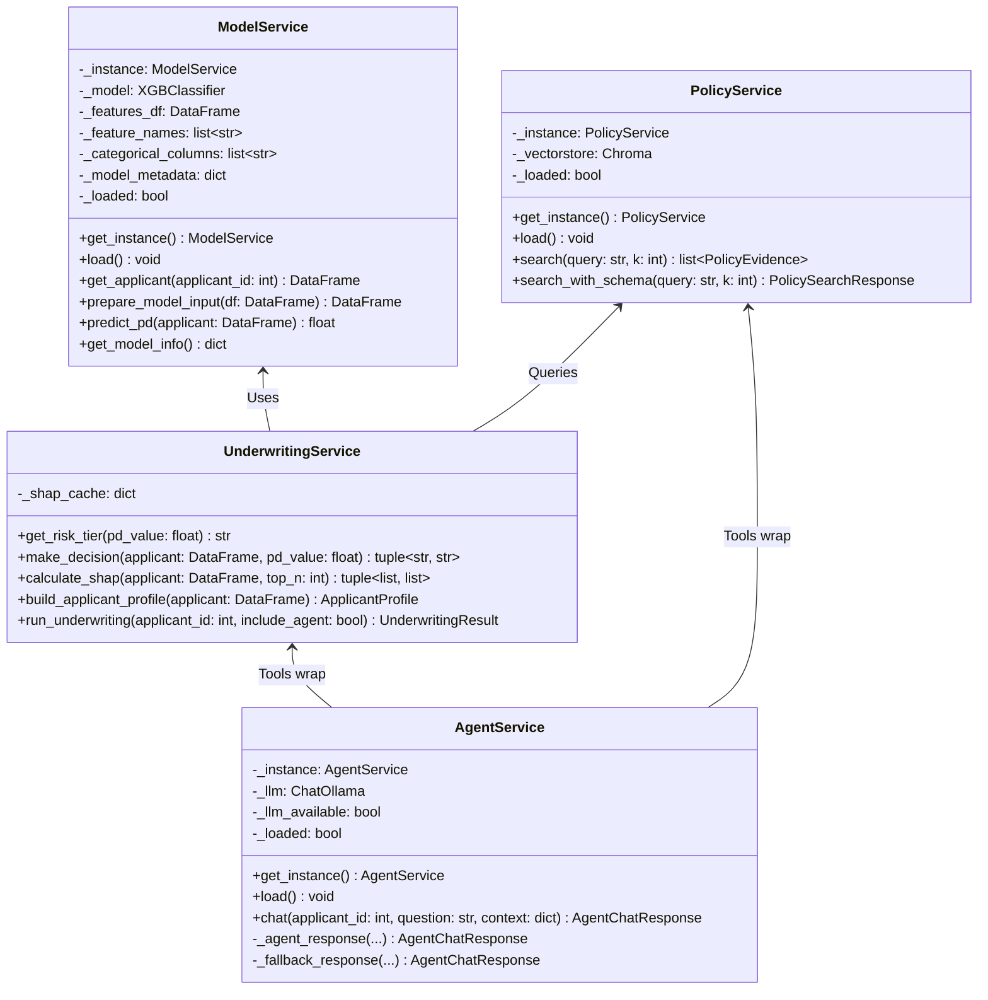
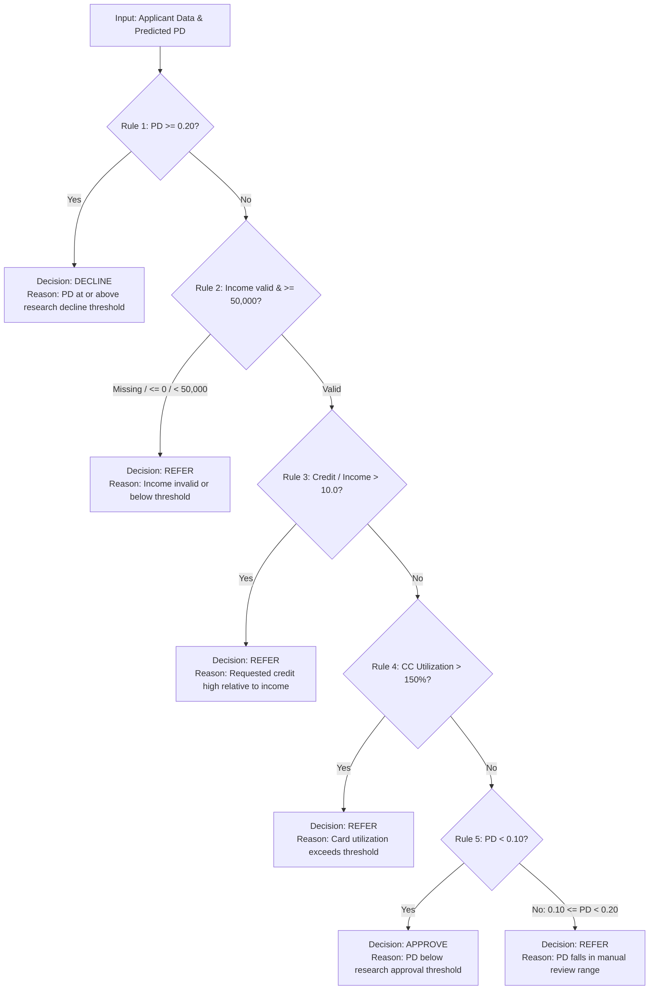
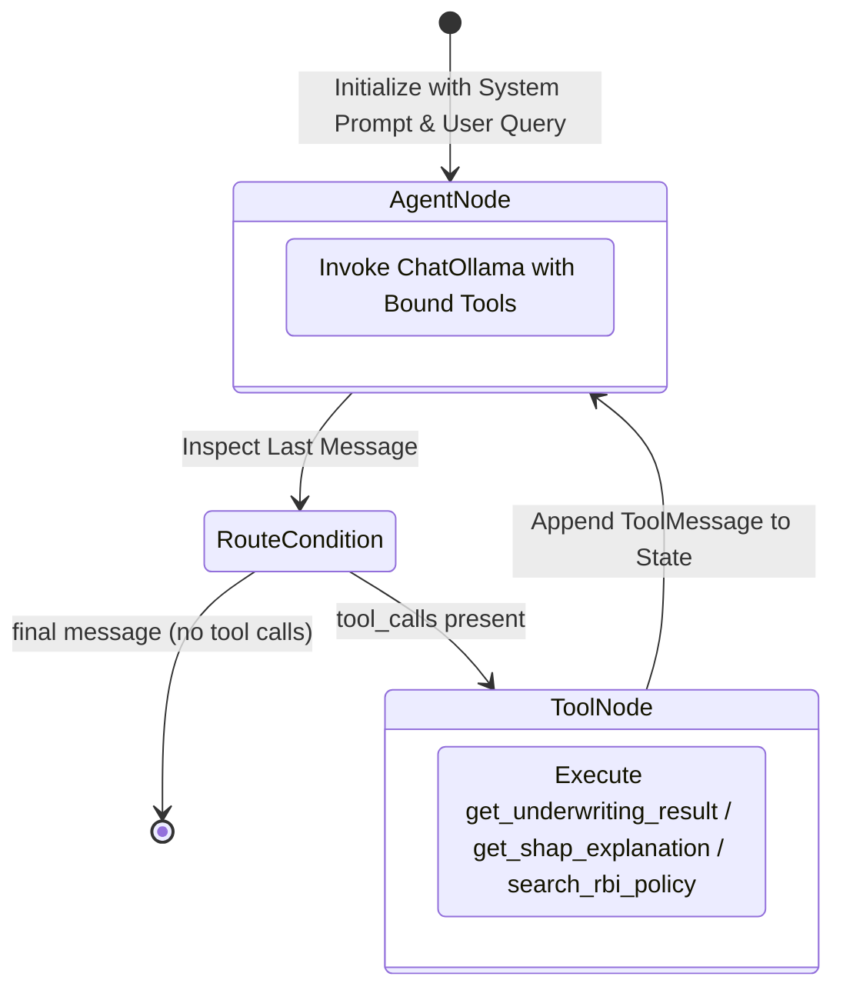

# Low-Level Design (LLD): Agentic AI Credit Underwriting System

## 1. Class & Component Design

### 1.1 Core Domain Services



---

## 2. Algorithmic & Mathematical Specifications

### 2.1 Machine Learning Model Formulation
The credit scoring model is an **XGBoost (eXtreme Gradient Boosting)** binary classification ensemble.
- **Objective Function**:
  $$\mathcal{L}(\theta) = \sum_{i=1}^n l(y_i, \hat{y}_i) + \sum_{k=1}^K \Omega(f_k)$$
  Where:
  $$l(y_i, \hat{y}_i) = - \left[ w \cdot y_i \log(\hat{y}_i) + (1 - y_i) \log(1 - \hat{y}_i) \right]$$
  - $y_i \in \{0, 1\}$: Target flag (1 = Default / 90+ days past due).
  - $w = \frac{\text{Count}(\text{Non-Defaults})}{\text{Count}(\text{Defaults})} \approx 11.39$: Computed via `scale_pos_weight` to counteract severe class imbalance.
  - $\Omega(f) = \gamma T + \frac{1}{2} \lambda \sum_{j=1}^T w_j^2$: Regularization term penalizing tree complexity and leaf weights.

### 2.2 TreeSHAP Feature Attribution
For an applicant's feature vector $x$, Shapley values $\phi_j(f, x)$ satisfy:
$$f(x) = \phi_0(f) + \sum_{j=1}^M \phi_j(f, x)$$
Where:
- $\phi_0(f) = \mathbb{E}[f(X)]$: Expected base prediction across the training population.
- $\phi_j(f, x)$: Contribution of feature $j$ to the deviation from the expected base prediction.
- In `calculate_shap()`:
  - **Risk-Increasing Factors**: $\phi_j > 0$ (increases estimated Probability of Default).
  - **Risk-Reducing Factors**: $\phi_j < 0$ (decreases estimated Probability of Default).
- **Non-Causality Constraint**: $\phi_j$ evaluates conditional model output sensitivity; it does not indicate empirical real-world causation.

### 2.3 Deterministic Policy Decision Matrix



#### Risk Tier Discretization
| Probability of Default (PD) | Risk Tier | Typical Outcome |
|---|---|---|
| $0.0\% \le \text{PD} < 5.0\%$ | `LOW` | `APPROVE` (if rules pass) |
| $5.0\% \le \text{PD} < 10.0\%$ | `MODERATE` | `APPROVE` (if rules pass) |
| $10.0\% \le \text{PD} < 20.0\%$ | `HIGH` | `REFER` (Manual review) |
| $\text{PD} \ge 20.0\%$ | `VERY_HIGH` | `DECLINE` |

---

## 3. LangGraph Agent State Machine



### Agent Tool Contracts
1. `get_underwriting_result(applicant_id: int) -> str`: Returns deterministic JSON with `probability_of_default`, `risk_tier`, `decision`, `policy_reason`.
2. `get_shap_explanation(applicant_id: int) -> str`: Returns top 5 positive and negative feature attributions and the non-causal disclaimer.
3. `search_rbi_policy(question: str) -> str`: Runs ChromaDB similarity search and returns regulatory excerpts with `authority: "Reserve Bank of India"`.

---

## 4. Database Schema Details (SQLAlchemy ORM)

### Table: `underwriting_decisions`
| Column Name | Data Type | Constraints | Description |
|---|---|---|---|
| `id` | `INTEGER` | Primary Key, Autoincrement | Internal row ID |
| `request_id` | `VARCHAR(36)` | Unique, Index, Non-null | UUIDv4 per underwriting request |
| `applicant_id` | `INTEGER` | Index, Non-null | Home Credit identifier (`SK_ID_CURR`) |
| `timestamp` | `TIMESTAMP` | Non-null, UTC | Decision generation timestamp |
| `probability_of_default` | `FLOAT` | Non-null | Predicted probability (0.0 to 1.0) |
| `risk_tier` | `VARCHAR(20)` | Non-null | `LOW`, `MODERATE`, `HIGH`, `VERY_HIGH` |
| `decision` | `VARCHAR(20)` | Non-null | `APPROVE`, `REFER`, `DECLINE` |
| `policy_reason` | `TEXT` | Nullable | Deterministic reason string |
| `model_version` | `VARCHAR(100)` | Nullable | Model version ID (`pd_xgboost_v1`) |
| `policy_version` | `VARCHAR(100)` | Nullable | Policy version ID (`research_policy_v1`) |
| `risk_increasing_factors` | `JSON` | Nullable | Top positive SHAP factors |
| `risk_reducing_factors` | `JSON` | Nullable | Top negative SHAP factors |
| `agent_assessment` | `TEXT` | Nullable | Natural language summary (if LLM used) |
| `llm_used` | `BOOLEAN` | Default: False | Flag whether LLM assisted |

### Table: `audit_logs`
| Column Name | Data Type | Constraints | Description |
|---|---|---|---|
| `id` | `INTEGER` | Primary Key, Autoincrement | Audit sequence number |
| `timestamp` | `TIMESTAMP` | Non-null, UTC | Event log timestamp |
| `action` | `VARCHAR(100)` | Non-null | Action name (`underwrite`, `agent_chat`) |
| `applicant_id` | `INTEGER` | Nullable | Associated applicant ID |
| `request_id` | `VARCHAR(36)` | Nullable | Associated request UUID |
| `status` | `VARCHAR(20)` | Nullable | Status flag (`APPROVE`, `ok`, `failed`) |
| `detail` | `TEXT` | Nullable | Diagnostic information |

---

## 5. API Endpoint Specifications

### 5.1 `POST /underwrite`
- **Request Body**:
  ```json
  {
    "applicant_id": 370920
  }
  ```
- **Response Model**: `UnderwritingResult` (HTTP 200)
  ```json
  {
    "request_id": "8f3b25dc-3a1b-4f9e-8c4d-1e5b8d2e3f4a",
    "applicant_id": 370920,
    "timestamp": "2026-09-03T12:25:00.000Z",
    "probability_of_default": 0.035249,
    "risk_tier": "LOW",
    "decision": "APPROVE",
    "policy_reason": "Predicted probability of default is below the research approval threshold",
    "risk_increasing_factors": [
      {
        "feature": "credit_to_income",
        "value": "3.33",
        "shap": 0.1245,
        "effect": "Increased risk",
        "description": "Ratio of credit amount to annual income."
      }
    ],
    "risk_reducing_factors": [
      {
        "feature": "EXT_SOURCE_3",
        "value": "0.684",
        "shap": -0.4512,
        "effect": "Decreased risk",
        "description": "External credit bureau score 3."
      }
    ],
    "regulatory_evidence": [
      {
        "source": "Guidelines_on_Digital_Lending.pdf",
        "authority": "Reserve Bank of India",
        "title": "Guidelines on Digital Lending",
        "page": "4",
        "version_date": "2022-09-02",
        "jurisdiction": "India",
        "content": "Regulated Entities shall ensure that any collection of data..."
      }
    ],
    "model_information": {
      "model_type": "XGBoost",
      "task": "Probability of Default (Binary Classification)",
      "training_dataset": "Home Credit Default Risk",
      "model_version": "pd_xgboost_v1",
      "feature_count": 88,
      "shap_note": "SHAP values indicate feature contribution to model output..."
    },
    "policy_version": "research_policy_v1",
    "disclaimer": "RESEARCH PROTOTYPE ONLY..."
  }
  ```
- **Error Codes**:
  - `404 Not Found`: Applicant ID not present in feature dataset.
  - `422 Unprocessable Entity`: Applicant ID outside integer bounds (100,000 - 9,999,999).
  - `500 Internal Server Error`: Computation or database failure.

### 5.2 `POST /policy/search`
- **Request Body**: `{"query": "borrower consent", "k": 4}`
- **Response Model**: `PolicySearchResponse` containing `results: list[PolicyEvidence]`.

### 5.3 `POST /agent/chat`
- **Request Body**: `{"applicant_id": 370920, "question": "Why was this applicant approved?"}`
- **Response Model**: `AgentChatResponse` with `answer`, `llm_available`, and disclaimer.

---

## 6. Error Handling & Resilience Matrix

| Failure Scenario | Component Affected | Mitigation / Handling Strategy |
|---|---|---|
| Ollama service down or unreachable | `AgentService` | Fallback gracefully to deterministic text summary containing PD, risk tier, decision, and manual review notice. No HTTP 500 error thrown. |
| Vector DB directory missing or corrupted | `PolicyService` | Catches `Exception`, logs warning, and returns empty `regulatory_evidence: []`. Underwriting decision continues unaffected. |
| Missing features for an applicant | `ModelService` | Validates column presence against `artifact["features"]`. Fills missing numericals with `NaN` (natively handled by XGBoost hist trees). |
| Division by zero in financial ratios | Feature Processing | Ratios computed with epsilon handling; infinite values converted to `NaN`. |
| Audit database lock or failure | Database Layer | Wraps audit commits in `try...except` with `db.rollback()`. Decision is returned to user even if audit write fails. |