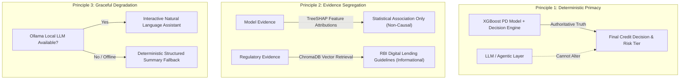
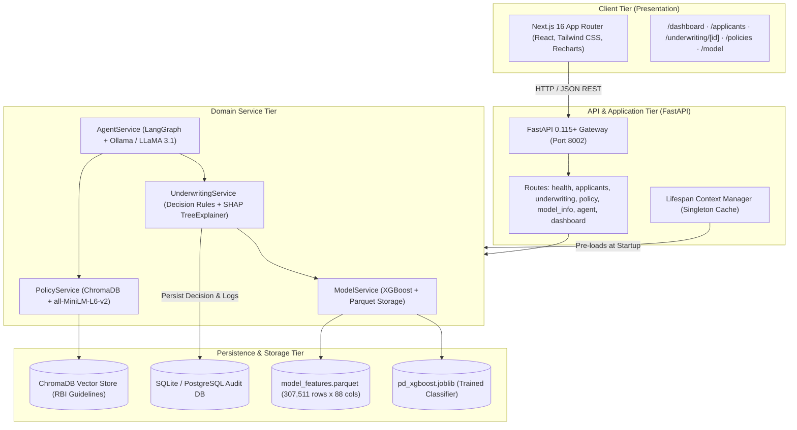
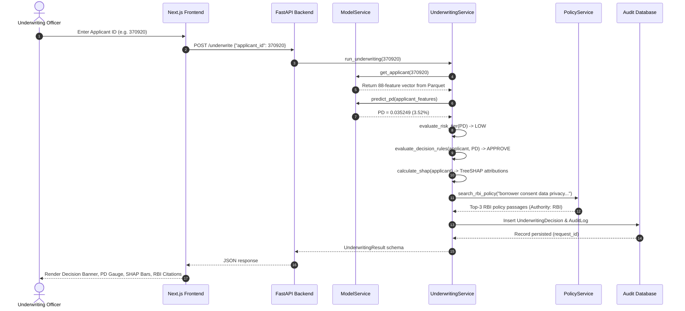

# System Architecture: Agentic AI-Based Credit Underwriting System

## 1. Executive Summary & Problem Statement

Credit underwriting in retail banking and digital lending requires evaluating an applicant's creditworthiness while maintaining strict compliance with financial regulations and fair lending standards. Traditional credit scoring systems rely either on black-box machine learning models (which lack explainability and regulatory alignment) or rigid manual rule-based scorecards (which struggle to leverage complex, non-linear relationships across multi-source financial data).

This project presents a **Hybrid Agentic Underwriting Architecture** that unifies:
1. **Predictive Machine Learning**: An XGBoost binary classification model estimating the empirical **Probability of Default (PD)** across 88 aggregated credit and demographic features.
2. **Explainable AI (XAI)**: Game-theoretic feature attribution via **TreeSHAP** (*SHapley Additive exPlanations*) to quantify positive and negative feature contributions per prediction without asserting causality.
3. **Deterministic Policy Rules**: A rule-based decision engine enforcing hard financial boundaries (minimum income, credit-to-income limits, credit card utilization caps) and assigning risk tiers.
4. **Regulatory Retrieval-Augmented Generation (RAG)**: A vector search engine querying the **Reserve Bank of India (RBI) Guidelines on Digital Lending (2022)** to ground credit assessments in relevant regulatory requirements.
5. **Agentic AI Orchestration**: A **LangGraph** reactive state machine that coordinates tools to answer underwriting queries while strictly enforcing evidence boundaries to prevent hallucinations.
6. **Audit & Traceability**: An append-only relational audit database capturing all decisions, SHAP breakdowns, and queries for regulatory review.

---

## 2. Core Architectural Principles

1. **Deterministic Truth as Ground Truth**: The Large Language Model (LLM) is **never** the decision maker. Credit decisions (`APPROVE`, `REFER`, `DECLINE`) and risk tiers (`LOW`, `MODERATE`, `HIGH`, `VERY_HIGH`) are computed deterministically by the Python rule engine and ML model. The LLM only interprets and summarizes verified evidence.
2. **Strict Evidence Segregation**: 
   - **Model Evidence** represents statistical feature importances from historical Home Credit default data.
   - **Regulatory Evidence** represents legal and supervisory directives issued by the Reserve Bank of India.
   These two evidence streams are never conflated or presented as substitutes for one another.
3. **Non-Causal Explanation Guarantee**: SHAP values quantify how much a feature moved the log-odds prediction relative to the base value. They do not represent causal levers (e.g., changing an applicant's age does not causally alter creditworthiness).
4. **Graceful Degradation**: Core underwriting, PD scoring, SHAP calculation, and regulatory retrieval operate independently of the LLM. If the local Ollama daemon is offline, all underwriting workflows complete successfully with deterministic text summaries.

---

## 3. High-Level Architectural Layers

### Layer Breakdown

| Layer | Technologies | Responsibilities |
|---|---|---|
| **Presentation Tier** | Next.js 16, React 19, TypeScript, Tailwind CSS, Recharts | User dashboard, interactive applicant profiles, visual risk gauges, SHAP impact charts, regulatory citations, AI chat interface |
| **API Gateway Tier** | FastAPI, Pydantic v2, Uvicorn, Python 3.10+ | HTTP routing, request validation, CORS middleware, global error handling, lifecycle resource caching |
| **Domain Logic Tier** | Scikit-learn, XGBoost, SHAP, LangGraph, LangChain | Inference execution, local explanation derivation, underwriting rule execution, multi-tool agent routing |
| **Knowledge & RAG Tier** | ChromaDB, HuggingFace `all-MiniLM-L6-v2`, PyPDF | Document chunking, vector indexing, similarity search, authority attribution |
| **Persistence Tier** | SQLAlchemy 2.0, SQLite (Dev) / PostgreSQL (Prod), Apache Parquet | High-performance feature storage (307k applicants), audit logging, decision records |

---

## 4. End-to-End Data & Execution Flow

---

## 5. Security, Governance & Regulatory Compliance

1. **Model Governance**:
   - Model artifact is serialized with explicit metadata (model class, training feature names, categorical column indices, threshold benchmarks).
   - Training baseline default rate and validation metrics (ROC-AUC, PR-AUC, Brier score) are documented directly in model endpoints.
2. **Auditability**:
   - Every execution of `/underwrite` generates a unique UUID `request_id`, recording timestamp, inputs, calculated PD, risk tier, decision, reason, and complete SHAP factor breakdowns.
3. **Data Protection**:
   - Personal Identifiable Information (PII) is anonymized using synthetic Home Credit identifiers (`SK_ID_CURR`).
   - Sensitive financial ratios are bounded against division-by-zero anomalies.
4. **Fair Lending Disclaimers**:
   - Prominent disclaimers on every UI screen and API payload clarify that the platform is an academic research prototype and not a legally binding credit decision engine.